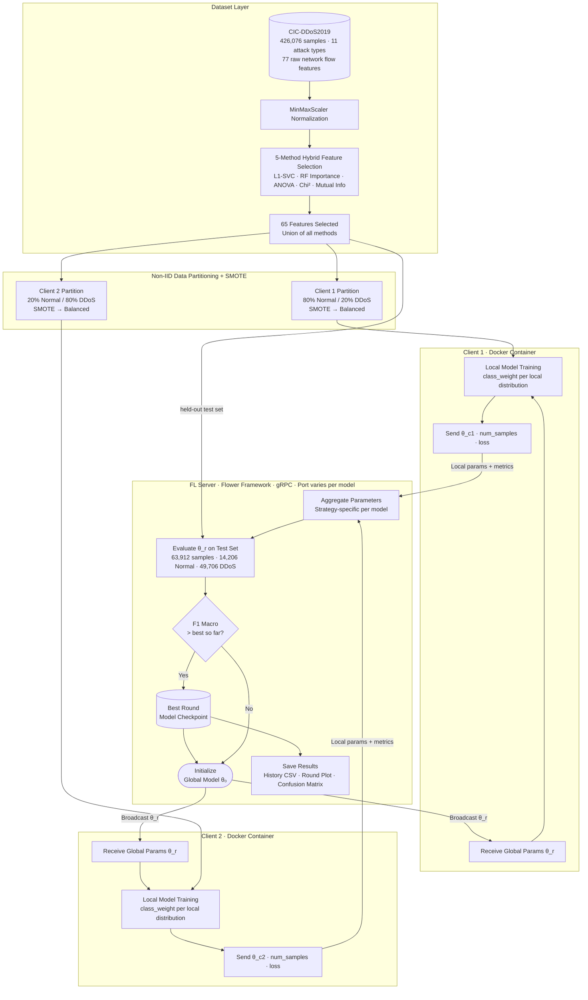
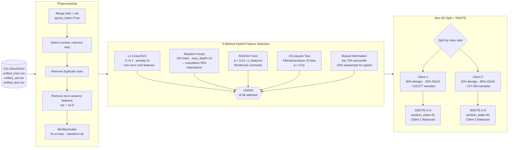
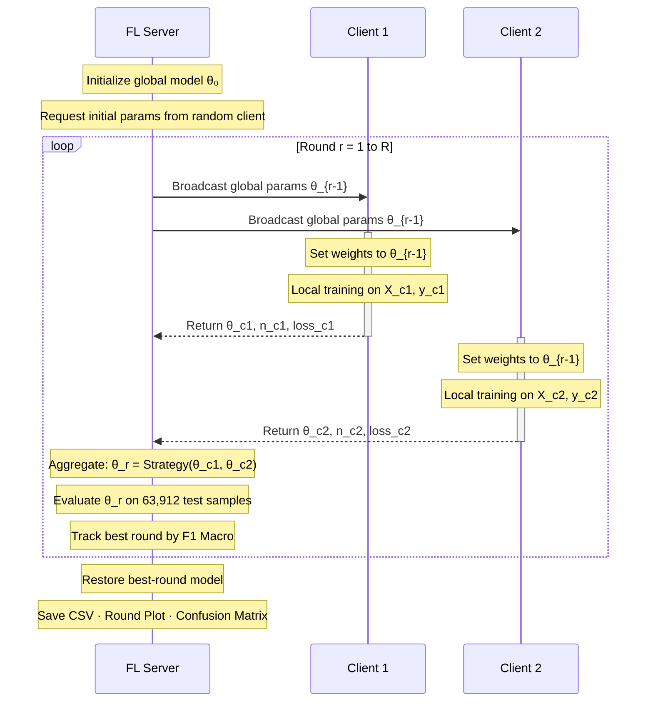
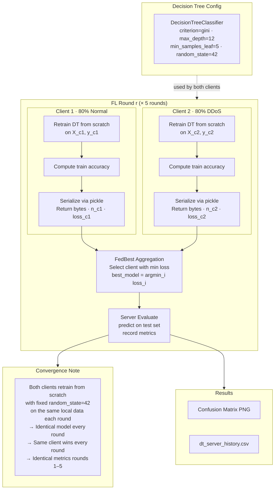
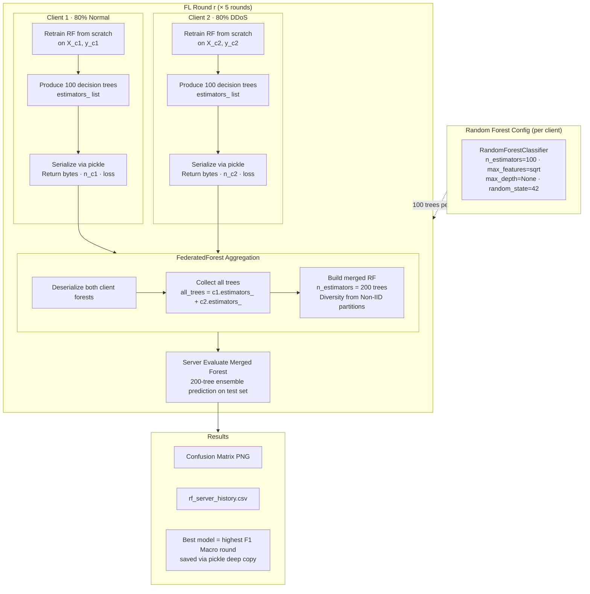
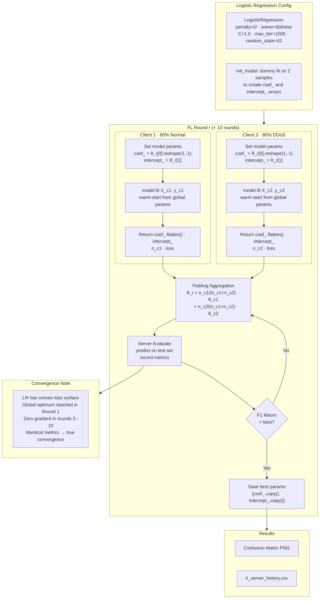
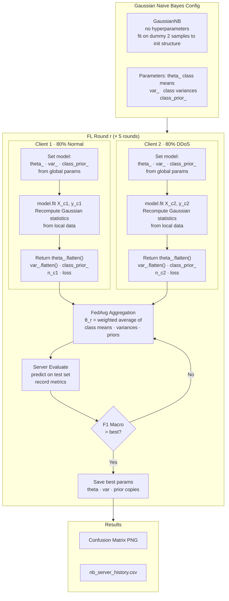
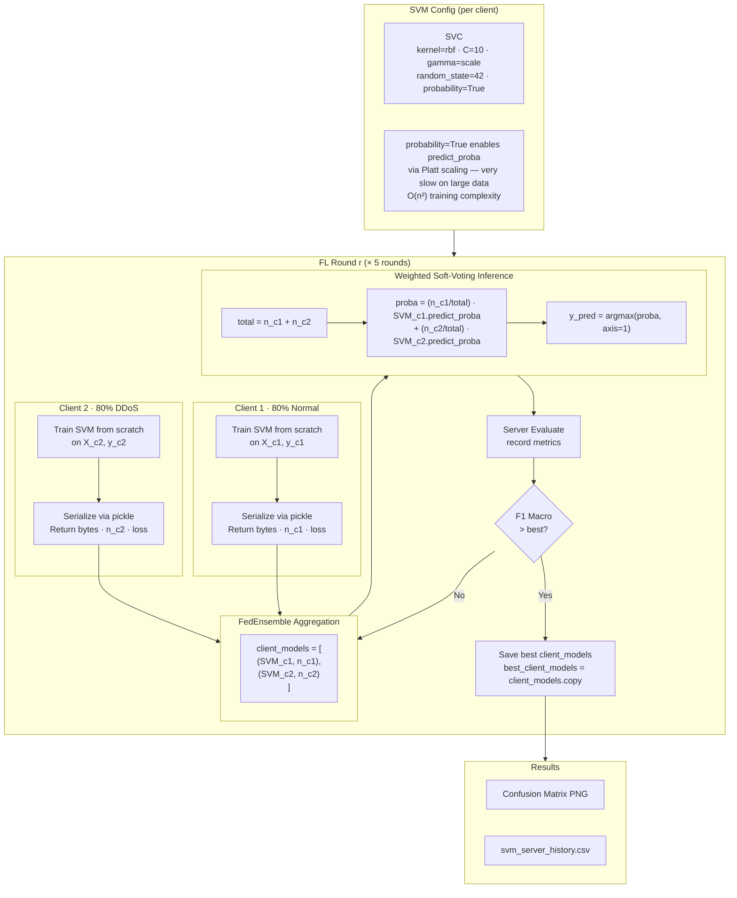
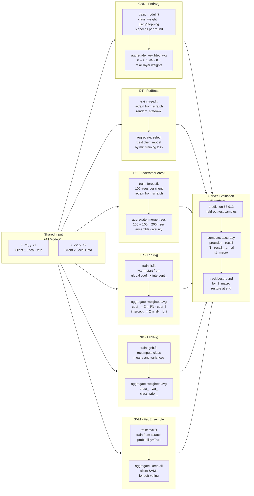
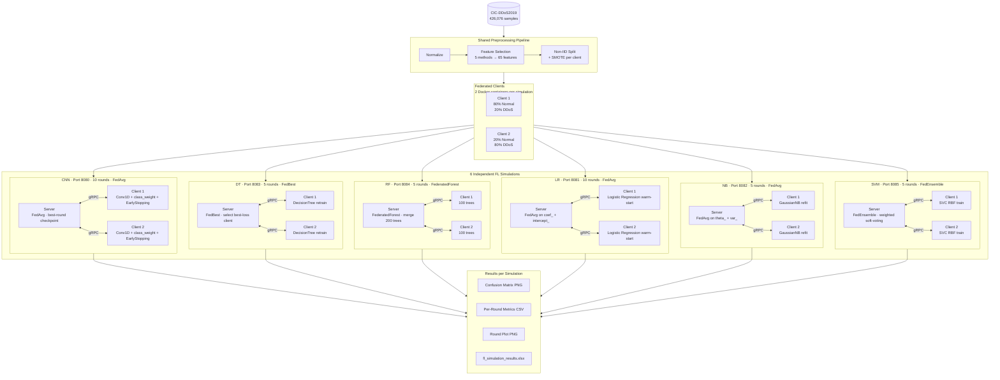

# FL Simulation — Architecture Diagrams (Mermaid)

---

## 1. Complete FL System Architecture Overview



---

## 2. Data Preprocessing & Feature Selection Pipeline



---

## 3. Generic FL Training Loop (Sequence Diagram)



---

## 4. CNN 1D — FedAvg with EarlyStopping + Class Weighting

```mermaid
flowchart TD
    subgraph MODEL["CNN 1D Architecture (per client)"]
        direction LR
        M1["Input\n65 × 1"] --> M2["Conv1D-64\nReLU · same padding"] --> M3[BatchNorm]
        M3 --> M4["Conv1D-64\nReLU · same padding"] --> M5[BatchNorm]
        M5 --> M6[MaxPooling1D] --> M7["Conv1D-128\nReLU · same padding"] --> M8[BatchNorm]
        M8 --> M9[GlobalAvgPool] --> M10["Dense-128\nReLU"] --> M11["Dropout 0.4"]
        M11 --> M12["Dense-1\nSigmoid"]
    end

    subgraph CLOOP["FL Round r (× 10 rounds)"]
        direction TB

        SRV["FL Server\nFedAvg: θ_r = Σ n_i/N · θ_i"]

        subgraph TR1["Client 1 · 80% Normal / 20% DDoS"]
            T1A[Set weights = θ_{r-1}]
            T1B["Compute class_weight\n{0: n/2·n_neg, 1: n/2·n_pos}"]
            T1C["model.fit\nEpochs=5 · batch=128\nEarlyStopping patience=3"]
            T1D[Return θ_c1 · n_c1 · loss]
            T1A --> T1B --> T1C --> T1D
        end

        subgraph TR2["Client 2 · 20% Normal / 80% DDoS"]
            T2A[Set weights = θ_{r-1}]
            T2B["Compute class_weight\n{0: n/2·n_neg, 1: n/2·n_pos}"]
            T2C["model.fit\nEpochs=5 · batch=128\nEarlyStopping patience=3"]
            T2D[Return θ_c2 · n_c2 · loss]
            T2A --> T2B --> T2C --> T2D
        end

        EVAL["Server Evaluate\npredict on 63,912 test samples\nthreshold = 0.5\nrecord acc · prec · rec · f1_macro"]
        BEST{F1 Macro\n> best?}
        CKPT[(Save best\nweights)]

        SRV -->|"broadcast θ_{r-1}"| T1A & T2A
        T1D & T2D -->|"weighted average"| SRV
        SRV --> EVAL --> BEST
        BEST -->|Yes| CKPT
    end

    subgraph OUT["After Round 10"]
        O1[Restore best-round weights]
        O2[Confusion Matrix PNG]
        O3[cnn_server_history.csv]
        O4[Round metrics plot PNG]
    end

    MODEL -.->|"architecture used by both clients"| CLOOP
    BEST -->|No / next round| SRV
    CKPT --> O1 --> O2 & O3 & O4
```

---

## 5. Decision Tree — FedBest Strategy



---

## 6. Random Forest — FederatedForest Strategy



---

## 7. Logistic Regression — FedAvg on Linear Parameters



---

## 8. Naive Bayes — FedAvg on Gaussian Statistics



---

## 9. SVM — FedEnsemble (Weighted Soft-Voting)



---

## 10. All FL Strategies — Side-by-Side Comparison



---

## 11. Full FL Simulation — One Diagram (All Models Together)



---

## Rendering Instructions

To use these diagrams in your paper:

**Option 1 — Online renderer (easiest)**
Paste each code block into https://mermaid.live → export as SVG or PNG.

**Option 2 — VS Code**
Install the "Markdown Preview Mermaid Support" extension → preview this file → screenshot or export.

**Option 3 — Command line**

```bash
npm install -g @mermaid-js/mermaid-cli
mmdc -i fl_architecture_diagrams.md -o diagram.png
```

**For LaTeX paper**: Export each diagram as PDF or high-res PNG, then include with `\includegraphics`.
